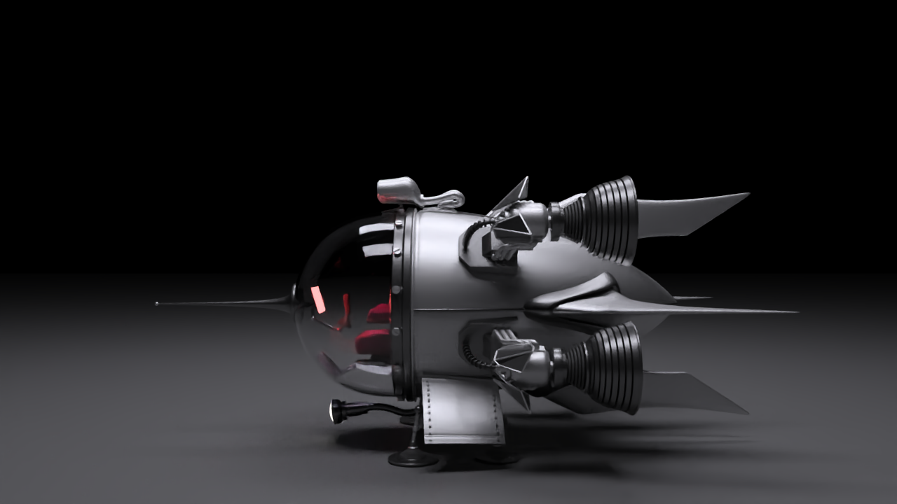
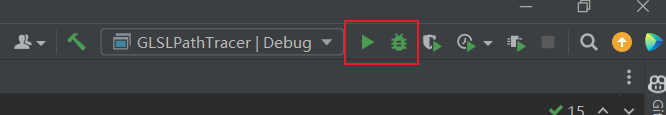
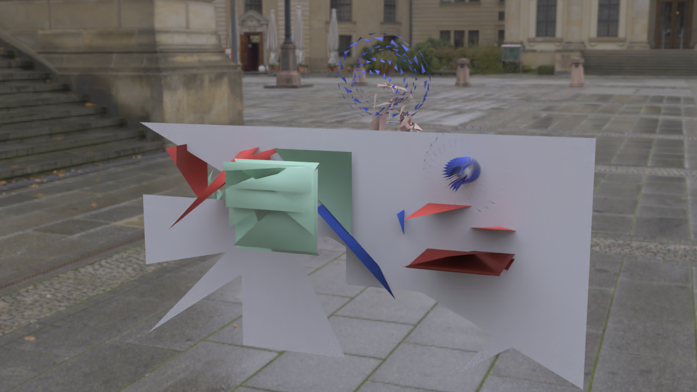

# PathTracer-CLion-Tutorial



This is a GLSL-based PathTracer developed using CLion, my preferred IDE due to its convenience and lightweight nature compared to Visual Studio. This project draws significant inspiration from [GLSL-PathTracer](https://github.com/knightcrawler25/GLSL-PathTracer), a remarkable path tracing repository. Building upon this foundation, I have meticulously re-implemented all the code and provided comprehensive explanations, essentially creating a tutorial from the ground up, including guidance on writing the CMake file. Additionally, I've incorporated support for loading `.blend` files, although there are still some issues to address in the mesh loading functionality.


## CLion Configuration

#### CLion Configuration

1. Download CLion from [CLion](https://www.jetbrains.com/clion/) and install

2. Download the bundled mingw

   1. Go to File->Settings->Build, Execution, Deployment->Toolchains

      

   2. In the setting `Toolset`, if the `Bundled MinGW` is not set as default, just hit `Download...` to download the default mingw and click `Apply` and `OK` to finish the setting for mingw.

#### Clone the code

```bach
git clone https://github.com/yijie21/PathTracer-CLion-Tutorial.git
```

#### Create the CLion Project

1. Create a new CLion Project and name it whatever as you like (for example `PathTracer`)
2. Copy the code into the CLion Project
   1. Copy `src`, `thirparty`, `assets`, `doc`, `scenes` and `CMakeLists.txt` into the root directory of your CLion project.
   2. Copy the `dll` in the `dlls` directory into the `cmake-build-debug` folder of the CLion project for debugging.

#### CMake Configurations

1. Write configurations for the project.

   1. Replace `project(GLSLPathTracer)` with `project(YOUR PROJECT NAME)`
   2. And all the other settings are already set, fully explained and well organised. You can follow these steps in every other C++ project.

2. Just hit the two buttons in CLion for running and debugging!

   


### Scene Files

Scenes can be downloaded from https://drive.google.com/file/d/1UFMMoVb5uB7WIvCeHOfQ2dCQSxNMXluB/view.


### Features

- GLSL-based path tracing
- Disney BSDF supported
- gltf format supported
- **blend format supported (needs to be corrected)** 
- **Full code explanation (in progress)** 
- **Full pipeline explanation (in progress)**
- OpenImage Denoise


### Code Explanation

This repository is fully explained from the setup of opengl to the intricate details of path tracing. Most of the details are commented in the code to help you understand it more easily, and some complicated details are explained using separate `md` files in the `doc` directory. 


### References

- GLSL-PathTracer (https://github.com/knightcrawler25/GLSL-PathTracer)
- fbtBlend-Header-Only (https://github.com/Flix01/fbtBlend-Header-Only)
- Ray Tracing in One Weekend (https://raytracing.github.io/)
- Physically-based Rendering 3rd edition (https://pbr-book.org/)


The blend file loading result still needs to be corrected.

